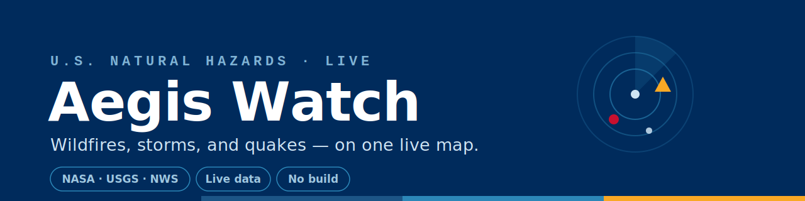
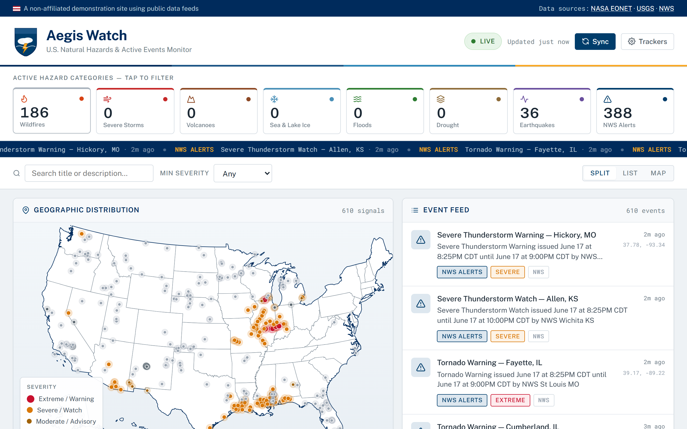

<p align="center">
  
</p>

<h1 align="center">Aegis Watch</h1>

<p align="center"><b>A live, single-page dashboard for U.S. natural hazards — straight from NASA, USGS, and the National Weather Service.</b></p>

<p align="center">
  
  
  
  
</p>

Doomscrolling, but make it useful. **Aegis Watch** plots what's happening across the country *right now* on one map, color-coded by how much it should ruin your day. Wildfires, volcanoes, earthquakes, severe-weather alerts — one screen, no login, no key required.

## A look inside

<p align="center">
  
</p>

<p align="center"><i>A live national view — wildfires, quakes, and active NWS alerts, color-coded by severity.</i></p>

## What it does

- **Live hazard map** — events plotted across the U.S. and colored by severity.
- **Multi-source** — wildfires & volcanoes from **NASA EONET**, earthquakes from **USGS**, alerts from the **NWS**.
- **Filter & search** — narrow by hazard type, severity, or keyword.
- **Detail drawer** — drill into any event for the specifics.
- **Trackers** — watch a region and opt into browser notifications when something changes.
- **Auto-refresh** — re-syncs every few minutes so the map stays current.

## Quick start

It's a static site — but it needs an internet connection, because it pulls live data from public APIs.

```bash
git clone https://github.com/your-username/aegis-watch.git
cd aegis-watch
# open index.html in your browser (needs internet for live data)
```

It also loads D3 and TopoJSON from a CDN. Want it fully self-hosted/offline-capable? Vendor those two libraries locally and update the `<script>` tags.

## Data sources & disclaimer

Pulls from public, key-free government APIs:

- **NASA EONET** — wildfires, volcanoes, severe storms
- **USGS** — real-time earthquake feed
- **NOAA / National Weather Service** — active weather alerts

> **Not affiliated with or endorsed by NASA, USGS, NOAA, or the NWS.** Aegis Watch is an independent project for situational awareness and curiosity only. In an actual emergency, always follow official guidance from local authorities and the agencies above.

## Privacy

No account, no analytics, no tracking. Any trackers or notification preferences you set are stored locally in your browser.

## Built with

Vanilla JavaScript with **D3** + **TopoJSON** for the map (`us-atlas` topology), and Public Sans / Roboto Mono via Google Fonts. The entire app is a single `index.html`.

## Contributing

Issues and PRs welcome — especially new hazard sources and smarter severity scoring.

## License

[MIT](LICENSE)

---

<p align="center"><sub>Made with care as part of <b>Reuben's</b> little toolbox.</sub></p>
